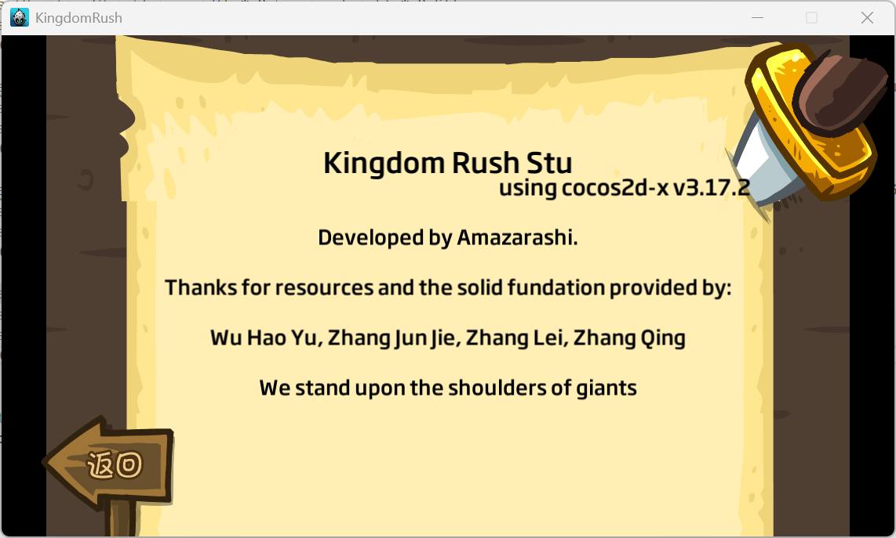

# 项目简介

这是一份南京大学智能科学与技术专业大二学生秋季课程程序设计实训的课程项目。本项目仿照经典塔防游戏王国保卫战：前线(KingdomRush:Frontiers)进行开发，并以开源项目[KingdomRushFrontiers](https://github.com/exmex/KingdomRushFrontiers)和Cocos2d引擎为基础。我们首先对于原项目进行深入地学习、理解，并成功完成复现，随后对于原项目的缺陷进行了修复和完善并自主进行了功能扩展实现。   

解压后，你可以在文件夹内看到原项目的资源文件。目前，资源文件已经替换为我们完善后的版本。

# 项目贡献

相较原开源项目的区别与贡献，请参见仓库内的说明文档，不再赘述。

# 致谢

感谢Wu Hao Yu, Zhang Jun Jie, Zhang Lei, Zhang Qing他们完成的优秀的开源项目，让我们受益匪浅。我们站在了巨人的肩膀上。

